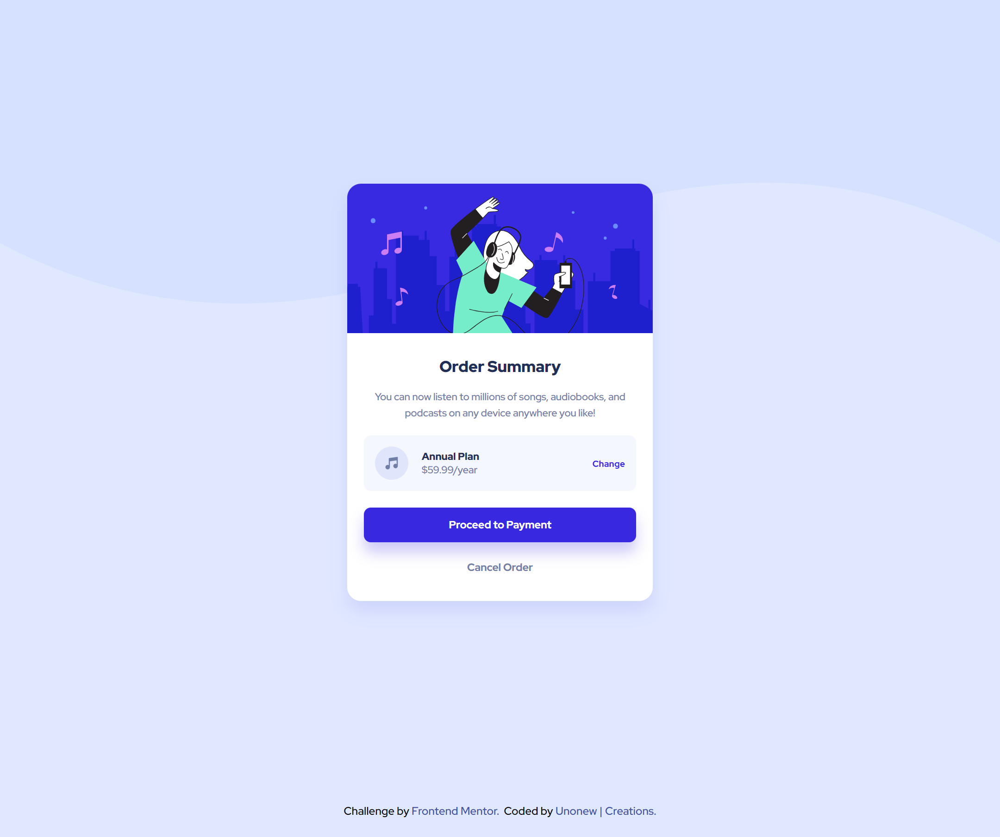
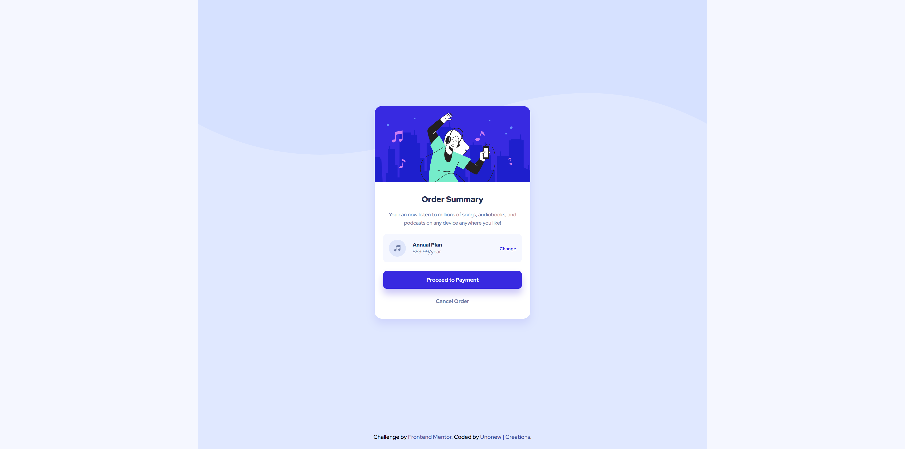

# Frontend Mentor - Order summary card solution

This is a solution to the [Order summary card challenge on Frontend Mentor](https://www.frontendmentor.io/challenges/order-summary-component-QlPmajDUj). Frontend Mentor challenges help you to improve your coding skills by building realistic projects.

## Table of contents

- [Overview](#overview)
  - [The challenge](#the-challenge)
  - [Screenshot](#screenshot)
  - [Links](#links)
- [My process](#my-process)
  - [Built with](#built-with)
  - [What I learned](#what-i-learned)
  - [Continued development](#continued-development)
  - [Useful resources](#useful-resources)
- [Author](#author)
- [Acknowledgments](#acknowledgments)

## Overview

### The challenge

Users should be able to:

- See hover states for interactive elements

### Screenshot





### Links

- [Solution URL](https://github.com/unonewcreations/summary-card-component)
- [Live Site URL](https://unonewcreations.github.io/summary-card-component/)

## My process

### Built with

- Semantic HTML5 markup
- CSS custom properties
- Flexbox

### What I learned

Use this section to recap over some of your major learnings while working through this project. Writing these out and providing code samples of areas you want to highlight is a great way to reinforce your own knowledge.

Proud of the following codes:

HTML:

```html
<div class="plan-box">
  <div class="plan-box-left">
    
    <div class="plan-details">
      <h2>Annual Plan</h2>
      <p>$59.99/year</p>
    </div>
  </div>
</div>
```

CSS:

```css
:root {
  /* primary colors */
  --primary-pale-blue: hsl(225, 100%, 94%);
  --primary-bright-blue: hsl(245, 75%, 52%);

  /* neutral colors */
  --neutral-very-pale-blue: hsl(225, 100%, 98%);
  --neutral-desaturated-blue: hsl(224, 23%, 55%);
  --neutral-dark-blue: hsl(223, 47%, 23%);

  /* fonts */
  --main-fonts: "Red Hat Display", sans-serif;

  /* font weights */
  --regular-font-weight: 500;
  --semi-font-weight: 700;
  --extra-font-weight: 900;
}
```

### Continued development

I wil continue to develop the my skills with HTML, CSS and JS.

### Useful resources

- [MDN](https://www.mdn.com) - This helped me for looking up how to use properties. Amazing source of information.
- [GitHub](https://www.github.com) - This is an great website for searching code examples.

## Socials

- Website - [Unonew Creations](https://www.unonew.com)
- Frontend Mentor - [@unonewcreations](https://www.frontendmentor.io/profile/unonewcreations)
- Twitter - [@unonewcreations](https://www.twitter.com/unonewcreations)

<div id="top"></div>
<div align="center">

<a href="https://www.frontendmentor.io/profile/unonewcreations"></a>
<a href="https://www.instagram.com/unonewcreations/"></a>
<a href="https://www.discord.com/users/739993828915675176/"></a>
<a href="https://twitter.com/unonewcreations"></a>
<a href="https://www.unonew.com"></a>

## Acknowledgments

This is where you can give a hat tip to anyone who helped you out on this project. Perhaps you worked in a team or got some inspiration from someone else's solution. This is the perfect place to give them some credit.
